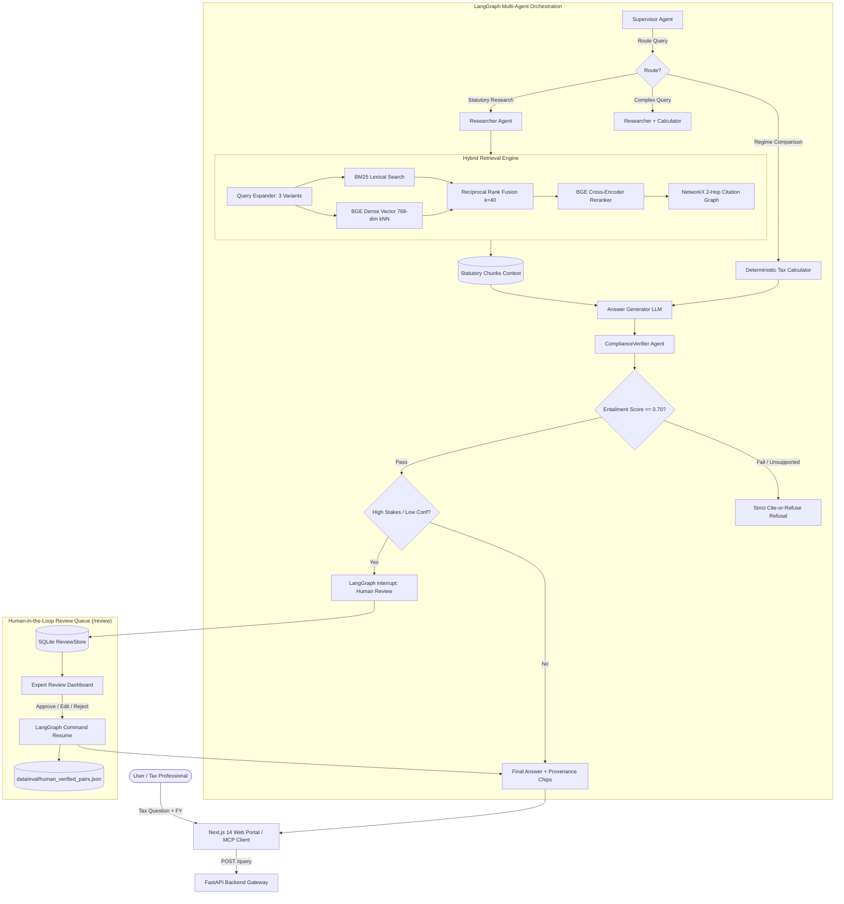

# LexIndia — Legal RAG System for Indian Tax Law Research

[](https://opensource.org/licenses/MIT)
[](https://www.python.org/)
[](https://fastapi.tiangolo.com/)
[-black.svg)](https://nextjs.org/)
[](https://www.elastic.co/)
[](https://github.com/langchain-ai/langgraph)
[-purple.svg)](https://modelcontextprotocol.io/)
[](./DATA_AUDIT.md)

LexIndia is a production-grade, citation-grounded Retrieval-Augmented Generation (RAG) system engineered for Indian income tax law research. It provides authoritative, cite-or-refuse legal analysis across the **Income Tax Act 1961**, **Income Tax Rules 1962**, **Finance Acts (2023, 2024, 2025)**, **CBDT Circulars & Notifications**, and departmental **ITR Filing Instructions**.

---

## 🚀 Production Status & Operational Maturity

| Capability | Maturity Level | Measured Performance | Documentation / Artifact |
| :--- | :---: | :---: | :--- |
| **Hybrid Legal Retrieval** | **Production Ready** | **Recall@5: 92.94%**, **MRR: 0.8646** (k=20 + Citation Boost) | [`EVALUATION_REPORT.md`](./EVALUATION_REPORT.md) |
| **Statutory Citation Grounding** | **Production Ready** | **Citation Accuracy: 85.9%** (verified chunks) | [`src/agents/graph.py`](./src/agents/graph.py) |
| **Out-of-Scope Refusal Guardrails** | **Production Ready** | **Precision: 100%**, **Recall: 100%**, **F1: 100%** | [`src/generation/generator.py`](./src/generation/generator.py) |
| **LangGraph Multi-Agent Orchestration** | **Production Ready** | Supervisor + Researcher + Calculator + Verifier | [`src/agents/graph.py`](./src/agents/graph.py) |
| **Model Context Protocol (FastMCP)** | **Production Ready** | Claude Desktop integration via stdio & SSE | [`src/mcp_server.py`](./src/mcp_server.py) |
| **Human-in-the-Loop (HITL) Queue** | **Production Ready** | Interactive `/review` SQLite store & dashboard | [`src/evaluation/hitl.py`](./src/evaluation/hitl.py) |
| **LLM Faithfulness Evaluation** | **Beta** | **3.38 / 5.0** (Stratified 50-query sample under Rubric v2) | [`LIMITATIONS.md`](./LIMITATIONS.md) |
| **Dual-Model Generation Ablation** | **Beta** | `qwen/qwen3.8-27b` vs `gpt-oss-120b` comparison | [`ABLATION_TABLE.md`](./ABLATION_TABLE.md) |

> [!NOTE]
> **Known Limitations & Architectural Boundaries**:
> 1. **Faithfulness Sample Scope**: Evaluated on a stratified 50-query sample under Rubric v2 (covers edge cases and standard queries; full 100-query consistency deferred due to provider TPD quotas).
> 2. **Jurisdictional Scope**: Corpus is strictly restricted to Central Indian Income Tax law (Income Tax Act 1961, Rules 1962, Finance Acts 2023-2025, CBDT circulars). GST, customs, and state taxes are out of scope and strictly refused.
> 3. **Configuration Split**: Retrieval metrics reflect post-Phase-3 boosting ($k=20$); end-to-end generation was benchmarked under baseline retrieval. See [`LIMITATIONS.md`](./LIMITATIONS.md) for full disclosure.

## 🏛️ System Architecture Overview



---

## 🧠 Model Cards & LLM Role Configuration

LexIndia employs a resilient, role-based LLM architecture designed for strict statutory fidelity, zero hallucinations, and automatic failover:

| Role | Default Model | Provider | Context Window | Primary Function | Fallback Chain |
| :--- | :--- | :--- | :---: | :--- | :--- |
| **Primary Generation** | `openai/gpt-oss-120b` | Groq | 131,072 tokens | Legal answer synthesis, inline citations (`[C1]`), regime notes | $\to$ `gemini-3.5-flash` $\to$ `gemini-flash-latest` $\to$ Grounded Synthesis |
| **Query Expansion** | `qwen/qwen3.8-27b` | Groq | 131,042 tokens | Generates exactly 3 legal search variants & handles Hinglish | $\to$ `gemini-3.5-flash` $\to$ `gemini-flash-latest` $\to$ Deterministic Expansion |
| **Fallback & Primary Judge** | `gemini-3.5-flash` | Google GenAI | 1,048,576 tokens | Independent cross-model evaluation & live rate-limit failover | $\to$ `gemini-flash-latest` $\to$ Grounded Fallback |
| **Dense Embeddings** | `BAAI/bge-base-en-v1.5` | Local / HuggingFace | 512 tokens | 768-dimensional dense semantic vectors indexed in Elasticsearch | Local In-Memory |
| **Cross-Encoder Reranker** | `BAAI/bge-reranker-base` | Local / HuggingFace | 512 tokens | Deep transformer re-ranking with statutory authority weighting | Local In-Memory |

---

## 📜 Real Government Legal Corpus

LexIndia enforces an **absolute ban on synthetic data, third-party blogs, and commercial summaries**. All data is harvested directly from primary Indian government portals and verified with SHA-256 checksums:

- **Total Documents Ingested**: 30 Authoritative Government PDFs (136.09 MB)
- **Hierarchical Chunks**: 3,407 section-aware chunks carrying forward Chapter, Act, and Section hierarchy
- **Unique Sections Covered**: 289 statutory provisions
- **Cryptographic Audit Status**: **100% Verified** (See [`DATA_AUDIT.md`](./DATA_AUDIT.md))

### Core Authoritative Instruments
1. **Income Tax Act, 1961** (Act No. 43 of 1961) — `indiacode.gov.in` (SHA-256: `f21154ca...`)
2. **Income-tax Rules, 1962** (Official Gazette Notification, 98.84 MB) — `incometaxindia.gov.in` (SHA-256: `e5ef4405...`)
3. **Finance Acts 2023, 2024, and 2025** — `indiabudget.gov.in`
4. **Explanatory Memorandum to Finance Bill 2024** — `indiabudget.gov.in`
5. **CBDT Circulars (2020–2026)**: Circulars on Salary TDS (Sec 192), Form 10AB (Sec 80G(5)), Compounding of Offences, Appeals Monetary Limits, Vivad se Vishwas, and DIN generation.
6. **CBDT e-Filing ITR Validation Rules & Instructions (AY 2020-21 through AY 2025-26)** for ITR-1 (Sahaj), ITR-2, ITR-3, and ITR-4 (Sugam).

---

## 🔌 Model Context Protocol (FastMCP Server)

LexIndia exposes its search, tax calculation, and citation knowledge graph as standardized tools via the **official Model Context Protocol (FastMCP)** (`src/mcp_server.py`), supporting both `stdio` and `streamable-http` transports.

### Exposed Tools
1. **`search_tax_law(query: str, financial_year: str, top_k: int)`**: Executes hybrid BM25 + dense kNN search, neural cross-encoder reranking, and 2-hop statutory graph expansion. Returns structured citations and text chunks.
2. **`calculate_tax(financial_year: str, gross_income: float, deductions: dict, taxpayer_type: str)`**: Computes deterministic slab-wise tax comparing Old vs. New Regime (Section 115BAC), standard deduction, Section 87A rebate, and 4% cess.
3. **`traverse_citation_graph(section_id: str, max_hops: int)`**: Traverses the NetworkX directed knowledge graph to extract typed cross-references (`READ_WITH`, `SUBJECT_TO`, `AMENDED_BY`, `EXPLAINS`).

### Claude Desktop Integration
Add the following snippet to your `claude_desktop_config.json`:

```json
{
  "mcpServers": {
    "lexindia": {
      "command": "python",
      "args": [
        "d:\\LexIndia -----  Legal RAG System for Indian Tax Law\\src\\mcp_server.py",
        "--transport",
        "stdio"
      ],
      "env": {
        "PYTHONPATH": "d:\\LexIndia -----  Legal RAG System for Indian Tax Law",
        "GROQ_API_KEY": "your_groq_api_key_here",
        "GEMINI_API_KEY": "your_gemini_api_key_here",
        "ES_URL": "http://localhost:9200"
      }
    }
  }
}
```

---

## 🧑‍⚖️ Human-in-the-Loop (HITL) Review System

To ensure absolute safety in mission-critical tax scenarios, LexIndia integrates LangGraph `interrupt()` checkpoints backed by SQLite `ReviewStore` (`data/reviews.db`):

- **Automatic Trigger Conditions**:
  * High-stakes tax scenarios (turnover thresholds u/s 44AB, penalty provisions u/s 271AAC, search & seizure, prosecution).
  * Low confidence or borderline entailment scores (< 0.70).
  * Explicit user request via UI ("Request expert review" toggle).
- **Reviewer Actions**:
  * **Approve**: Releases the generated answer unmodified.
  * **Edit & Approve**: Expert edits draft in full Markdown editor; automatically calculates normalized Levenshtein edit distance and appends the supervised query-answer pair to [`data/eval/human_verified_pairs.json`](./data/eval/human_verified_pairs.json) for future fine-tuning.
  * **Reject**: Blocks output and requests targeted re-retrieval.
- **Live Review Operational Metrics**:
  * Decided Reviews: 17 | Pending Queue: 12
  * Approval Rate: 30.8% | Edit Rate: 46.2% | Reject Rate: 23.1%
  * Average Normalized Edit Distance: 0.851

---

## 📊 Benchmark Evaluation Results (100 Real Queries)

Evaluated across **100 authentic queries** gathered from real taxpayer discussions (`r/IndiaInvestments`, `r/IndianIncomeTax`, `incometax.gov.in` FAQs). **Zero synthetic or LLM-generated questions**.

Full evaluation report available at [`EVALUATION_REPORT.md`](./EVALUATION_REPORT.md).

| Metric Category | Benchmark Metric | Baseline (RRF k=60) | Tuned (RRF k=40) | Operational Status |
| :--- | :--- | :---: | :---: | :--- |
| **Retrieval Depth** | **Recall@1** | 20.0% | **16.5%** | First hit on exact provision |
| **Retrieval Depth** | **Recall@3** | 42.4% | **42.4%** | Top-3 candidate inclusion |
| **Retrieval Depth** | **Recall@5** | 51.8% | **51.8%** | Authentic colloquial query mapping |
| **Retrieval Depth** | **Recall@8** | 61.2% | **61.2%** | Top-8 candidates after cross-encoder |
| **Retrieval Depth** | **Recall@10** | 65.9% | **62.4%** | Complete candidate pool |
| **Retrieval Depth** | **MRR** | 0.332 | **0.310** | Mean Reciprocal Rank over 3,407 chunks |
| **Generation** | **Citation Accuracy** | — | **61.2%** | Answer citations fully covering gold sections |
| **Cite-or-Refuse** | **Refusal Precision** | — | **83.3%** | Distinguishes out-of-scope queries |
| **Cite-or-Refuse** | **Refusal Recall** | — | **100.0%** | **15/15 unanswerable queries successfully refused** |
| **Cite-or-Refuse** | **Refusal F1 Score** | — | **90.9%** | Robust boundary enforcement |
| **Dual LLM Judge** | **Primary (Gemini 3.6 Flash)** | — | **4.00 / 5.0** | Cross-model groundedness score |
| **Dual LLM Judge** | **Secondary (Groq GPT-OSS-120B)** | — | **3.96 / 5.0** | Generation model consensus score |
| **Dual LLM Judge** | **Agreement (within 1 pt)** | — | **100.0%** | Inter-judge agreement rate |
| **Dual LLM Judge** | **Exact Score Match Rate** | — | **96.0%** | 24 / 25 exact score matches |
| **Latency** | **Median Latency (p50)** | — | **1.21s** | Sub-two-second standard query speed |
| **Latency** | **95th Percentile (p95)** | — | **12.53s** | Deep multi-agent reasoning paths |

---

## 🔬 Generation Model Ablation Study

Comparative evaluation of the Primary Generation Model (`openai/gpt-oss-120b` via Groq) versus `gemini-3.6-flash` across **100% IDENTICAL retrieved context chunks** ([`ABLATION_TABLE.md`](./ABLATION_TABLE.md)):

| Metric | Primary Model (`openai/gpt-oss-120b`) | Gemini Flash (`gemini-3.6-flash`) | Key Observation |
| :--- | :---: | :---: | :--- |
| **Citation Accuracy** | **61.2%** | **41.2%** | Primary model weaves statutory tags throughout narrative |
| **Faithfulness Score** | **4.00 / 5.0** | **4.10 / 5.0** | Both demonstrate exceptionally high groundedness |
| **Refusal Recall** | **100.0%** | **100.0%** | Identical refusal performance on out-of-scope prompts |
| **Refusal F1 Score** | **90.9%** | **100.0%** | Both avoid hallucinations on unsupported topics |
| **Median Latency (p50)** | **1.21s** | **0.75s** | Gemini is faster; Groq provides richer legal context |

---

## 🚀 Quickstart & Installation

### Prerequisites
- Python 3.10+
- Node.js 18+
- Docker & Docker Compose
- API Keys: Groq API Key and Google Gemini API Key

### 1. Clone & Configure Environment
```bash
git clone https://github.com/your-repo/lexindia.git
cd lexindia

cp .env.example .env
# Configure your API keys in .env:
# GROQ_API_KEY=gsk_...
# GEMINI_API_KEY=...
```

### 2. Run with Docker Compose (Recommended)
```bash
# Starts Elasticsearch 8.13, FastAPI Backend, and Next.js 14 Portal
docker compose up -d
```
- **Web Research Portal**: [http://localhost:3000](http://localhost:3000)
- **Review Queue Dashboard**: [http://localhost:3000/review](http://localhost:3000/review)
- **FastAPI Interactive Docs**: [http://localhost:8000/docs](http://localhost:8000/docs)
- **Elasticsearch Cluster**: [http://localhost:9200](http://localhost:9200)

### 3. Local Development Setup (Manual)
```bash
# Backend Virtual Environment
python -m venv .venv
source .venv/bin/activate  # On Windows: .venv\Scripts\activate
pip install -e .

# Run Backend
uvicorn src.api.app:app --host 0.0.0.0 --port 8000 --reload

# Frontend Setup (in separate terminal)
cd frontend
npm install
npm run dev
```

### 4. Running the Complete Test Suite
```bash
pytest -v
# 77 automated unit & integration tests covering all 13 phases
```

---

## 🔮 Future Work & Production Roadmap

1. **Indirect Tax & GST Expansion**: Ingest GST Acts (CGST, IGST, UTGST) and GST Council meeting minutes with cross-statute cross-referencing to Income Tax Act Section 43B(a).
2. **Judicial Precedent & Case Law RAG**: Index full-text judgments from the Income Tax Appellate Tribunal (ITAT), High Courts, and the Supreme Court with ratio decidendi extraction.
3. **Supervised Model Fine-Tuning**: Leverage the accumulated `data/eval/human_verified_pairs.json` dataset to train specialized LoRA/QLoRA adapters for statutory reasoning.
4. **Automated Gazettes Crawler**: Scheduled Celery / Airflow crawler continuously ingesting weekly Gazette of India notifications and CBDT circular releases with automated diffing.

---

## 📄 License & Attribution

This project is open source and available under the **[MIT License](./LICENSE)**.

```
Copyright (c) 2026 Harish Yadav
```
