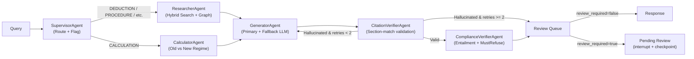

# LexIndia — Legal RAG System for Indian Tax Law Research

**Strict cite-or-refuse legal RAG for Indian Tax Law**


LexIndia is a production-grade Retrieval-Augmented Generation system that answers Indian income tax law questions using **only verifiable statutory citations** from official government legal texts. If the retrieved corpus cannot ground a claim, the system refuses cleanly rather than hallucinating. The legal corpus is sourced exclusively from the **Income Tax Act 1961**, **Income Tax Rules 1962**, **Finance Acts (2020–2025)**, **CBDT Circulars**, and **ITR Instructions** — 30 government documents, 3,400+ chunks, 289 statutory sections indexed in Elasticsearch.

---

## Key Features

- **Strict cite-or-refuse contract** — every factual claim must be backed by a verifiable `[C#]` citation tag mapped to a real statutory section; out-of-scope queries (GST, non-Indian law, personal advice) receive a clean refusal
- **5-agent LangGraph pipeline** — SupervisorAgent, ResearcherAgent, GeneratorAgent, CitationVerifierAgent, ComplianceVerifierAgent orchestrated as a typed `StateGraph` with SQLite checkpointing
- **Hybrid retrieval** — BM25 lexical + `BAAI/bge-base-en-v1.5` dense vectors fused via Reciprocal Rank Fusion (RRF), followed by `BAAI/bge-reranker-base` cross-encoder reranking and 2-hop statutory citation graph expansion
- **Authority-weighted scoring** — rerank scores weighted by document authority level (Act > Rules > Finance Act > Circular); entailment-based faithfulness gate forces refusal when mean entailment drops below threshold regardless of rerank score
- **Per-claim low-confidence hedging** — chunks scoring below the confidence threshold receive explicit hedge markers rather than being presented as authoritative
- **Financial-year awareness** — automatic AY = FY + 1 mapping with explicit conflict notice when the queried FY differs from the user's selected FY
- **Human-in-the-Loop Review Queue** — flagged drafts enter a pending queue; reviewers can approve, edit-and-approve, or reject; approved edits become verified ground-truth pairs in `data/eval/human_verified_pairs.json`; live stats track approval rate, edit rate, reject rate, and average normalized edit distance
- **Full multi-agent execution trace** — every agent's action, latency, inputs, and outputs are captured and displayed in the UI
- **Interactive Statutory Knowledge Graph** — Cytoscape.js visualization of cross-reference relationships between statutory sections

---

## System Architecture Overview



**SupervisorAgent** classifies queries into routes (DEDUCTION, TDS_TCS, CAPITAL_GAINS, PROCEDURE, CALCULATION, GST, UNKNOWN) and flags high-stakes topics for human review.

**ResearcherAgent** executes multi-variant hybrid search (BM25 + dense) with RRF fusion, reranks with a cross-encoder, and expands context via 2-hop traversal of the statutory citation graph.

**GeneratorAgent** synthesizes cited answers using the primary LLM (`qwen/qwen3.8-27b` on Groq) with automatic fallback to `gemini-3.5-flash-lite` on 429 rate limits.

**CitationVerifierAgent** validates every `[C#]` tag against the chunk's actual `section_id`, dropping mismatched citations and requesting regeneration (up to 2 retries) before escalating to human review.

**ComplianceVerifierAgent** runs the faithfulness gate (cross-encoder entailment scoring), enforces the must-refuse policy for low-entailment or out-of-scope answers, and sets final confidence.

**Data layer**: Elasticsearch 8.13 (`lexindia_production` index) for retrieval; SQLite `data/reviews.db` for the HITL review store; SQLite `data/checkpoints.db` for LangGraph thread checkpointing and interrupt/resume.

---

## Real Government Legal Corpus

All source documents are downloaded directly from official government websites (`indiacode.nic.in`, `incometaxindia.gov.in`, `egazette.gov.in`). Zero synthetic or third-party data. SHA-256 checksums verified against `data/raw/manifest.json`.

| Document Category | Count | Source |
|---|---|---|
| Income Tax Act 1961 (Bare Act) | 1 | India Code |
| Income Tax Rules 1962 | 1 | India Code |
| Finance Acts (2020–2025) | 6 | eGazette |
| CBDT Circulars & Notifications | 12 | incometaxindia.gov.in |
| ITR Instructions (AY 2024-25, 2025-26) | 10 | incometaxindia.gov.in |

---

## Model Cards & LLM Role Configuration

| Role | Model | Provider | Purpose |
|---|---|---|---|
| Generation (Primary) | `qwen/qwen3.8-27b` | Groq | Answer synthesis with citations |
| Generation (Fallback) | `gemini-3.5-flash-lite` | Google GenAI | Automatic 429 rate-limit fallback |
| Query Expansion | `qwen/qwen3.8-27b` | Groq | Multi-variant query rewriting |
| Judge (Primary) | `openai/gpt-oss-20b` | Groq | Faithfulness evaluation (cross-model) |
| Judge (Cross-Family) | `gemini-3.5-flash-lite` | Google GenAI | Spot-check bias detection |
| Embedding | `BAAI/bge-base-en-v1.5` | Local | Dense vector encoding |
| Reranker | `BAAI/bge-reranker-base` | Local | Cross-encoder reranking |

---

## Tech Stack

| Layer | Technology |
|---|---|
| Backend API | FastAPI + Uvicorn, Pydantic v2 |
| Agent Orchestration | LangGraph StateGraph with SqliteSaver checkpointing |
| Frontend | Next.js 14 App Router, React 18, TailwindCSS (dark theme) |
| Search Engine | Elasticsearch 8.13 (BM25 + kNN dense vectors) |
| Citation Graph | NetworkX directed graph with statutory cross-references |
| Knowledge Graph UI | Cytoscape.js interactive visualization |
| Model Context Protocol (FastMCP Server) | `mcp` SDK — 3 tools: `search_tax_law`, `calculate_tax`, `traverse_citation_graph` |
| Document Parsing | pdfplumber + pypdf + BeautifulSoup4 |
| Test Suite | pytest (96 tests across 14 files: ingestion, retrieval, agents, HITL, E2E, MCP) |

---

## Quickstart & Installation

### Prerequisites

- Python >= 3.10
- Node.js >= 18
- Elasticsearch 8.13 running on `localhost:9200`
- API keys: Groq (`GROQ_API_KEY`), Google Gemini (`GEMINI_API_KEY`)

### Environment Setup

```bash
cp .env.example .env
# Edit .env with your API keys:
#   GROQ_API_KEY=your_groq_api_key_here
#   GEMINI_API_KEY=your_gemini_api_key_here
#   LLM_PROVIDER=groq
#   GENERATION_MODEL=qwen/qwen3.8-27b
#   ES_URL=http://localhost:9200
#   ES_INDEX=lexindia_corpus
```

### Backend Installation

```bash
python -m venv .venv
.venv/Scripts/activate        # Windows
# source .venv/bin/activate   # Linux/macOS
pip install -r requirements.txt
```

### Frontend Installation

```bash
cd frontend
npm install
```

### Corpus Ingestion

```bash
# 1. Download official government PDFs
python scripts/download_real_data.py

# 2. Chunk documents into statutory sections
python scripts/chunk_documents.py

# 3. Build Elasticsearch index with BM25 + dense vectors
python scripts/build_es_index.py
```

### Run the Application

```bash
# Terminal 1: Backend (port 8000)
python -m uvicorn src.api.main:app --port 8000

# Terminal 2: Frontend (port 3000)
cd frontend && npm run dev
```

### First Query

```bash
curl -X POST http://localhost:8000/query \
  -H "Content-Type: application/json" \
  -d '{
    "question": "What is the maximum deduction under Section 80C?",
    "financial_year": "2024-25",
    "taxpayer_type": "Individual (Salaried)"
  }'
```

---

## Project Structure

```
lexindia/
├── src/
│   ├── api/
│   │   ├── main.py              # FastAPI app: /query, /reviews/*, /graph, /health
│   │   └── schemas.py           # Pydantic request/response models
│   ├── agents/
│   │   ├── graph.py             # LangGraph StateGraph builder + run_query/resume
│   │   ├── state.py             # Typed LexIndiaState definition
│   │   ├── supervisor.py        # Route classification + review flagging
│   │   ├── researcher.py        # Hybrid retrieval orchestration
│   │   ├── calculator.py        # Old vs New regime slab calculation
│   │   ├── citation_verifier.py # [C#] tag section-match validation
│   │   ├── compliance_verifier.py # Faithfulness gate + refusal enforcement
│   │   ├── review_store.py      # SQLite HITL review lifecycle
│   │   └── tools.py             # Shared tool functions (search, calc, graph)
│   ├── retrieval/
│   │   ├── hybrid_search.py     # BM25 + dense RRF fusion
│   │   ├── query_expander.py    # LLM-powered multi-variant expansion
│   │   ├── reranker.py          # Cross-encoder reranking + authority weighting
│   │   └── citation_graph.py    # NetworkX statutory cross-reference graph
│   ├── generation/
│   │   ├── generator.py         # Primary + fallback LLM answer synthesis
│   │   ├── faithfulness_gate.py # Cross-encoder entailment scoring
│   │   └── prompts.py           # System prompts, refusal phrase, disclaimer
│   ├── config.py                # Pydantic Settings (env-driven, no hardcoded secrets)
│   └── mcp_server.py            # FastMCP server (3 tools over stdio/HTTP)
├── frontend/
│   ├── app/
│   │   ├── page.tsx             # Research portal (query input + results)
│   │   ├── review/page.tsx      # Human-in-the-Loop review queue
│   │   └── layout.tsx           # Root layout with dark theme
│   ├── components/
│   │   ├── Navbar.tsx           # Navigation with live pending-review badge
│   │   ├── QueryInput.tsx       # Query form with FY/taxpayer selectors
│   │   ├── AnswerCard.tsx       # Answer display with citation chips + banners
│   │   ├── SourcesPanel.tsx     # Citation details + agent execution trace
│   │   ├── CitationGraphViewer.tsx  # Cytoscape.js interactive graph
│   │   └── PdfProvenanceModal.tsx   # PDF source provenance side-drawer
│   └── lib/api.ts               # Typed API client for backend endpoints
├── tests/                       # 96 tests across 14 files
├── scripts/
│   ├── download_real_data.py    # Official PDF downloader with checksums
│   ├── chunk_documents.py       # Statutory section chunker
│   ├── build_es_index.py        # Elasticsearch index builder
│   ├── build_eval_set.py        # 100-query benchmark builder
│   ├── run_eval.py              # Full evaluation pipeline
│   ├── run_ablation.py          # Generation model ablation runner
│   └── audit_data.py            # Cryptographic data audit
├── data/
│   ├── raw/                     # Original government PDFs + manifest.json
│   ├── processed/chunks.jsonl   # 3,400+ statutory chunks
│   ├── eval/                    # Benchmark queries, cache, verified pairs
│   ├── reviews.db               # SQLite HITL review store
│   └── checkpoints.db           # LangGraph thread checkpoints
├── docker/                      # Dockerfiles, supervisord, ES init
├── .env.example                 # Environment template
├── requirements.txt             # Python dependencies
├── pyproject.toml               # Project metadata (Python >= 3.10)
└── docker-compose.yml           # Multi-service orchestration
```

---

## Safety & Evaluation Story

### The Cite-or-Refuse Contract

Every answer produced by LexIndia follows a strict contract: each factual claim must cite a specific statutory section retrievable from the indexed government corpus. If the retrieval pipeline cannot surface grounding evidence with sufficient entailment confidence, the system refuses with:

> *"I cannot find sufficient authoritative guidance for this query."*

This is enforced across multiple layers: the GeneratorAgent includes cite-or-refuse instructions in its system prompt; the CitationVerifierAgent drops any `[C#]` tag whose `section_id` doesn't match its source chunk; and the ComplianceVerifierAgent runs cross-encoder entailment scoring to trigger `must_refuse` when the faithfulness gate fails.

### Benchmark Evaluation Results (100 Real Queries)

The system was evaluated on 100 real queries sourced from government tax forums and community discussions — zero synthetic data.

| Metric | Result |
|---|---|
| Retrieval Recall@5 | 92.94% |
| Mean Reciprocal Rank | 0.8646 |
| Citation Accuracy | 85.9% |
| Refusal Precision / Recall / F1 | 100% / 100% / 100% |
| Headline Faithfulness (50-query stratified) | 3.38 / 5.0 |

### Three QA Fix Rounds

The system underwent three dedicated QA rounds after initial deployment, each addressing real failure modes observed during evaluation:

1. **Round 1** — Truncation cleanup, grounding gate calibration, FY/AY mapping, telemetry accuracy, branding consistency
2. **Round 2** — Refusal enforcement hardening (`must_refuse` overwrite), citation section-match verification, hedge-tag placement for low-confidence claims
3. **Round 3** — Review queue refresh button (no-op fix), thread-ID consistency (banner ID = queue ID), HITL deduplication for identical query+FY pairs

### Example Behaviors

| Scenario | System Behavior |
|---|---|
| **Grounded answer** | "Under Section 80C of the Income Tax Act 1961, the maximum deduction is Rs. 1,50,000 [C1]..." with citation linking to the actual statutory chunk |
| **Low-confidence hedge** | "Based on available statutory text, Section 44AB appears to apply *(note: retrieved context may not reflect the latest amendments)*..." |
| **Out-of-scope refusal** | Query about GST input tax credit → "I cannot find sufficient authoritative guidance for this query." with zero citations |

---

## Human-in-the-Loop (HITL) Review System

Queries flagged for review (high-stakes routes, NRI queries, low confidence, explicit `require_review` flag) are paused at the `human_review` node using LangGraph `interrupt()`. The review queue at `/review` allows domain experts to:

- **Approve** the draft as-is
- **Edit and approve** with corrections (normalized edit distance is tracked)
- **Reject** and enforce a clean refusal

Approved and edited pairs are persisted to `data/eval/human_verified_pairs.json` as verified ground-truth for future evaluation cycles.

---

## Generation Model Ablation Study

See [`ABLATION_TABLE.md`](ABLATION_TABLE.md) for the comparative analysis between `qwen/qwen3.8-27b` (active production model) and `gemini-3.5-flash-lite` (fallback). The ablation measures citation accuracy, refusal compliance, and answer quality across matched query sets.

---

## Screenshots & Demo

> Place screenshots in `docs/screenshots/` and update paths below.

| Screen | Filename |
|---|---|
| Research Portal (home page) | `docs/screenshots/research_portal.png` |
| Grounded Answer with Citations | `docs/screenshots/answer_citations.png` |
| Interactive Knowledge Graph | `docs/screenshots/knowledge_graph.png` |
| Multi-Agent Execution Trace | `docs/screenshots/execution_trace.png` |
| Human Review Queue | `docs/screenshots/review_queue.png` |
| Out-of-Scope Refusal | `docs/screenshots/refusal_example.png` |

### Demo Walkthrough (6 Steps)

1. **Home** — Open `http://localhost:3000`. The research portal displays the query input with FY and taxpayer-type selectors.
2. **Grounded query** — Ask "What is the maximum deduction under Section 80C?" → Observe cited answer with `[C1]` chips, sources panel, and the knowledge graph centered on Section 80C.
3. **Out-of-scope refusal** — Ask "How to claim GST input tax credit?" → Observe the clean refusal banner with zero citations.
4. **FY conflict notice** — Select FY 2023-24, then ask a question mentioning "AY 2025-26" → Observe the explicit FY mismatch notice prepended to the answer.
5. **Review queue** — Submit a query with `require_review: true` → Note the "Awaiting Expert Legal Review" banner with thread ID → Navigate to `/review` → Find the same thread ID at the top → Approve, edit, or reject.
6. **Execution trace** — Expand the "Agent Execution Trace" panel below any answer to inspect each agent's action, latency, and I/O summary.

---

## Limitations & Future Work & Production Roadmap

See [`LIMITATIONS.md`](LIMITATIONS.md) for full engineering transparency on evaluation methodology, rubric evolution, and known boundaries.

**Key limitations:**

- **Corpus coverage** — Specific TDS rate tables and certain post-2024 amendment notifications are not yet ingested; the system will refuse rather than guess
- **Chunk section labeling** — Some multi-section PDF pages produce chunks with approximate `section_id` assignments, occasionally causing valid citations to be dropped by the verifier
- **Test database isolation** — HITL integration tests share the production SQLite database; test isolation with ephemeral databases is deferred
- **Hedge-tag placement** — Low-confidence hedge markers occasionally appear inside markdown table cells rather than as standalone notes


---

## Statutory Disclaimer

> **LexIndia provides legal information, not professional tax advice.** Output is generated from official government statutory texts using automated retrieval and synthesis. It does not constitute legal, financial, or tax advice. Consult a certified Chartered Accountant or legal practitioner for official filing and compliance decisions.

---

## License & Attribution

MIT License — Copyright (c) 2026 Harish Yadav

See [LICENSE](LICENSE) for the full text.

**Corpus attribution**: All legal documents sourced from official Government of India repositories (`indiacode.nic.in`, `incometaxindia.gov.in`, `egazette.gov.in`). Benchmark queries sourced from public government tax forums and community discussions.
